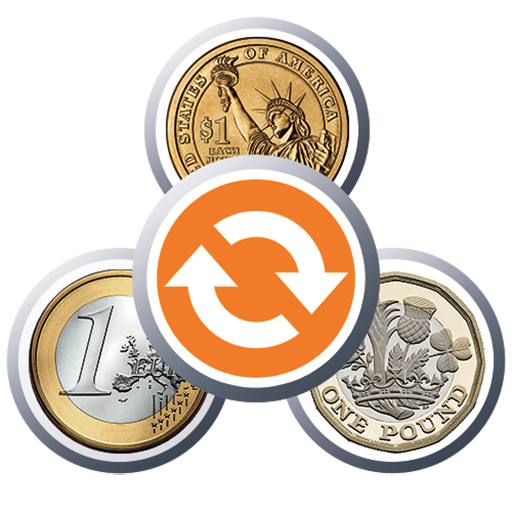

# Conversor de Moedas USD/BRL

Este projeto é um simples conversor de moedas, que permite converter valores de Dólar Americano (USD) para Real Brasileiro (BRL) e vice-versa. Ele também ajusta a formatação dos valores, substituindo o ponto por vírgula.

## Objetivo

- Criar uma aplicação que converte valores de USD para BRL e vice-versa.
- Ajustar a formatação de valores trocando "." por ",".
- Exibir o valor convertido no campo correspondente (BRL ou USD).

## Como Funciona

O projeto utiliza eventos de teclado e mouse para detectar quando o usuário insere ou altera valores nos campos de input. Assim que o valor é alterado, ele é automaticamente convertido para a outra moeda, e os valores são formatados para seguir o padrão brasileiro.

## Tecnologias Utilizadas

- **HTML**: Estrutura básica da página.
- **CSS**: Estilização da interface.
- **JavaScript**: Manipulação dos eventos e execução da conversão de moedas.

## Trechos Importantes do Código

### Manipulação de Variáveis

```js
let idade = 34;              // Tipo Number
let nome = "Hugo Hendrix";   // Tipo String
let logado = true;           // Tipo Boolean
```

### Arrays e Objetos

```js
let ingredientes = ["farinha", "água", "sal", "corante"];
console.log(ingredientes); // Mostra a quantidade de itens dentro do Array e seu conteúdo
console.log(ingredientes[0]); // Exibe o primeiro item do Array
```

```js
let personagem = {
    nome: "Guerreiro",
    nivel: 10,
    forca: 800,
    magia: 200,
    vida: 1000,
    mana: 200
};
console.log(personagem.forca); // Acessa a propriedade 'forca' do objeto 'personagem'
```

### Funções

```js
function somar(numeroA, numeroB) {
    return numeroA + numeroB;
}
console.log(somar(15, 15)); // 30
```

Exemplo com **arrow function**:

```js
let somar2 = (numeroA, numeroB) => numeroA + numeroB;
console.log(somar2(20, 20)); // 40
```

### Estruturas Condicionais

```js
if (idade >= 18) {
    console.log("Você é maior de idade");
} else {
    console.log("Você é menor de idade");
}
```

### Estruturas de Repetição

```js
let lista = ["Goku", "Naruto", "Luffy", "Yusuke"];
for (let item of lista) {
    console.log(item);
}
```

### Eventos

```js
let usdInput = document.querySelector("#usd");
let brlInput = document.querySelector("#brl");

usdInput.addEventListener("keyup", () => {
    console.log(usdInput.value);
});

brlInput.addEventListener("keyup", () => {
    console.log("Apertou o botão no campo BRL");
});
```

### Funções de Conversão

```js
function formatCurrency(value) {
    let fixedValue = fixValue(value);
    let options = {
        useGrouping: false,
        minimumFractionDigits: 2
    };
    let formatter = new Intl.NumberFormat("pt-BR", options);
    return formatter.format(fixedValue);
}

function fixValue(value) {
    let fixedValue = value.replace(",", ".");
    let floatValue = parseFloat(fixedValue);
    return isNaN(floatValue) ? 0 : floatValue;
}

function convert(type) {
    if (type === "usd-to-brl") {
        let fixedValue = fixValue(usdInput.value);
        let result = (fixedValue * dollar).toFixed(2);
        brlInput.value = formatCurrency(result);
    } else if (type === "brl-to-usd") {
        let fixedValue = fixValue(brlInput.value);
        let result = (fixedValue / dollar).toFixed(2);
        usdInput.value = formatCurrency(result);
    }
}
```

## Pesquisa Realizada

- Uso do Dev Tools e console log.
- Diferenças entre `let`, `var` e `const`.
- Tipos de variáveis e suas atribuições.
- Arrays e Objetos em JavaScript.
- Funções e Arrow Functions.
- Estruturas condicionais e de repetição.
- Eventos no JavaScript (`click`, `keyup`, `keydown`, `mouseover`).
- Formatação de números com `Intl.NumberFormat`.

## Próximos Passos

- Implementar a funcionalidade de pegar o valor atual da cotação das moedas via API.
- Explorar bibliotecas como **Heatmap.js** para análise de comportamento do usuário no site.

## Links

- [Link da aula](https://lp.b7web.com.br/aulajs-v)


